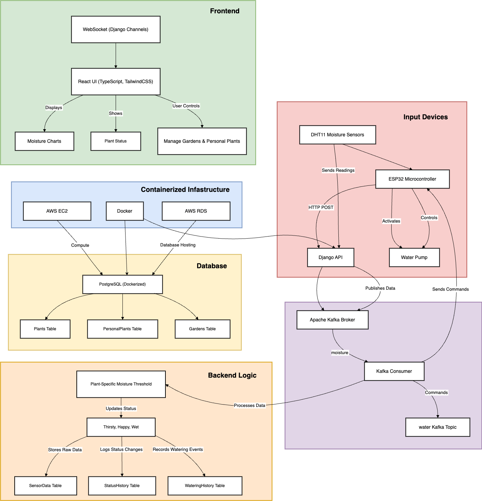

## Bloom
#### Table of Contents
- [Introduction](#introduction)
- [Tech Stack](#tech-stack) 
- [Database Schema](#database-schema)
- [Backend (Django + Django REST Framework)](#backend-django--django-rest-framework)
- [Messaging Layer (Apache Kafka)](#messaging-layer-apache-kafka)
- [Containerization & Cloud Hosting](#containerization--cloud-hosting)
- [Frontend (React + TypeScript + TailwindCSS)](#frontend-react--typescript--tailwindcss)
- [Dockerized Components](#dockerized-components)
- [Real-Time Updates](#real-time-updates)
- [Charting & Visualization](#charting--visualization)
- [Roadmap](#roadmap)
- [Notes](#notes)

### Live Demo
[Live Demo! ](https://www.loom.com/share/ecf26dbbf9f94d1483266473955b723d?sid=83af071a-fb54-4bf9-887d-52ea40ff8e3d)

<strong>Sensor Set-up </strong> (click to expand)

Inside the soil is the moisture probe (sensor), which is connected to a breakout board. The breakout board is wired to the ESP32 via the analog output. The probe detects soil moisture levels and the breakout board conditions the signal, providing a variable voltage that the ESP32 reads in real time for monitoring!

## Introduction

I created Bloom after struggling to keep my plants alive. The goal is to automate plant care (like watering) and visualize the plant’s health in real time. This project was also driven by desire to learn new tools and concepts, ranging from containerization and data streaming to working with sensors. 

**Summary**  
Bloom is a smart plant monitoring system that integrates sensors, real-time data processing, and a modern full-stack web interface. Bloom maintains database of 200+ plants and their unique environmental needs. An ESP32 connected to a moisture sensor monitors a plant's soil moisture. The plants status/sensor readings are streamed and updated in real time using kafka and websockets. When readings fall outside the optimal range (based on species-specific thresholds from Treffle.io), a warning is generated and automated watering is triggerd if the mositure is too low. The details and history of each personal plant is stored and can be viewed.

<strong>Data Flow </strong> (click to expand)

- **ESP32 producer lives in a separate repository (https://github.com/seraermolenko/Moisture)**  
- **Moisture thresholds are dynamically derived from Treffle.io plant data**

### 🌱  Tech Stack 

**Backend:** Django REST Framework  
**Frontend:** React + TypeScript + TailwindCSS (modular components, routing)  
**Messaging:** Apache Kafka for real-time soil data ingestion  
**Database:** PostgreSQL with pgAdmin4 for management  
**Containerization:** Docker with volumes (used for PostgreSQL + future deploy)  
**Microcontroller:** ESP32 (Wi-Fi enabled, reads DHT11 humidity sensor)  
**API:** Treffle.io used to populate plant database

### DataBase Schema

Tables:
- **Plants**: Stores public plant data (scientific name, care info, etc.)
- **Users** *(coming soon)*: Stores user accounts and garden ownership
- **Personal Plants**: Tracks a user’s individual plant (watering, age, custom name)
- **Gardens**: User-defined containers for organizing multiple PersonalPlants
- **SensorData** *(internal)*: Logs moisture values and timestamps
- **Status History**: Records each time a plant's status changes (e.g., Happy, Thirsty, Wet), along with the timestamp
- **Watering History**: Logs every time a plant is watered, automatically or manually, with the exact date and time

<strong>pgSnapshot</strong> (click to expand)

isture thresholds are dynamically derived from Treffle.io plant data*

### Backend (Django + Django REST Framework)

**Framework**: Django  
**API**: Django REST Framework

### Features

- **Sensor Data Ingestion:** Accepts POST data from ESP32 and streams it into Kafka
- **Real-Time Moisture Evaluation:** Kafka consumer evaluates soil moisture and updates plant status accordingly (`Thirsty`, `Happy`, `Wet`)
- **Auto-Watering Logic:** Automatically triggers watering if enabled and moisture falls below threshold
- **History Tracking:** Status and watering events are saved into separate tables for visual charting
- **Search & Filtering:** Users can search for plants by name and retrieve gardens/personal plants dynamically
- **Sensor Assignment:** Users can assign available sensor IDs to specific plants
- **Latest Reading API:** Frontend can poll latest moisture values per sensor
- **User & Garden Management:** Users can create, view, and delete gardens and personal plants
- **Data-Rich Plant Views:** Each personal plant includes detailed botanical and care metadata

### 📡 Messaging Layer (Apache Kafka)

**Version**: Kafka 4.0 in KRaft mode (no Zookeeper)

### Topics:
- `mositure` — Sensor readings  
- `water` — Watering command instructions  

#### Consumers/Producers:
- Consumer resets `mosisture` topic offset every 24h via shell script  
- Producer sends messages to `water` topic when watering needs are triggered  

### ☁️ Containerization & Cloud Hosting 

**Tools**: Docker, Amazon Web Services (AWS)

#### Planned Deployment:
- Use **EC2** for hosting Django backend and Kafka  
- Consider **RDS** for managed PostgreSQL  
- **S3** for static/media storage (if needed) 

### Frontend (React + TypeScript + TailwindCSS)

**Framework**: React with Vite  
**Languages**: TypeScript  
**Styling**: TailwindCSS

#### Features:
- View gardens and plants  
- Real-time updates using WebSocket  
- View moisture charts and history  
- Add/Delete/Update plants  
- UI states for status (*Thirsty*, *Happy*, etc.) with animated effects  

#### Modularized Components:
- Pages: `GardenPage`, `HomePage`  
- Modals: `AddPlantModal`, `DeleteConfirmModal`, `SettingsModal` 

### 🐳 Dockerized Components

- PostgreSQL DB  
- Django backend *(planned)*  

Use: Local dev setup and future deployment  

### ⚡ Real-Time Updates

**WebSocket**:
- Backend sends real-time updates on plant status to frontend via **Django Channels**  
- Frontend updates state without needing full re-fetch 

### 📊 Charting & Visualization

**Chart Library**: Recharts  

### Data Shown:
- Plant moisture/status over time  
- Only renders charts when history exists  

### Roadmap 

Completed
- [x] Defined initial schema
- [x] Populated database with top 100 plants from Treffle.io
- [x] Created Kafka producer (ESP32) and consumer (Django) pipeline
- [x] Created basic UI and component architecture with React
- [x] Connected Django API to frontend
- [x] Implemented auto-watering logic based on moisture thresholds
- [x] Connected sensor ID to PersonalPlant instance

Future Plans
- [ ] Add email or mobile notifications when moisture is too low
- [ ] Automate testing 
- [ ] Design and integrate a physical water pump circuit controlled via ESP32
- [ ] Add authentication and user accounts
- [ ] Enable garden sharing between friends
- [ ] Predict bloom/growth cycles using historical data
- [ ] Deploy Bloom backend on AWS EC2 for persistent hosting
- [ ] Improve frontend styling and performance

