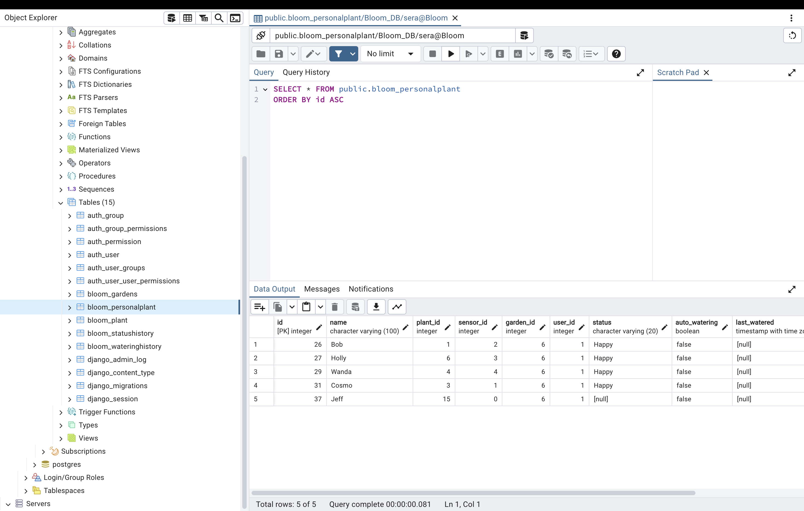

## Bloom
#### Table of Contents
- [Introduction](#introduction)
- [Tech Stack & Architecture](#Tech-Stack)
- [Database Schema](#database-schema)
- [Roadmap](#roadmap)
- [Notes](#notes)

#### Introduction

I created Bloom after struggling to keep my plants alive. The goal is simple: build an application that combines plant management, information, and automation. This project was also driven by desire to learn new tools and concepts, ranging from containerization and data streaming to working with sensors. 

**Summary:**  
Bloom maintains database of 200+ plants and their unique environmental needs. An ESP32 connected to a moisture sensor monitors a plant's soil moisture. The plants status/sensor readings are streamed and updated in real time using kafka and websockets. When readings fall outside the optimal range (based on species-specific thresholds from Treffle.io), a warning is generated and automated watering is triggerd if the mositure is too low. The details and history of each personal plant is stored and can be viewed.

Data Flow:
Moisture Sensor (DHT11)-> ESP32 -> HTTP POST -> Kafka broker ->  Django API -> Kafka Consumer -> Django Backend -> WebSocket -> React Frontend

- *ESP32 producer is defined in another repository called Humidity* 
- *Watering alerts are generated when the moisture level exceeds thresholds derived from Treffle.io plant data*

#### Tech Stack 

- Backend: Django REST Framework
- Frontend: React + TypeScript + TailwindCSS (modular components, routing)
- Messaging: Apache Kafka for real-time soil data ingestion
- Streaming: 
- Database: PostgreSQL with pgAdmin4 for management
- Containerization: Docker with volumes (used for PostgreSQL + future deploy)
- Microcontroller: ESP32 (Wi-Fi enabled, reads DHT11 humidity sensor)
- API: Treffle.io used to populate plant database

- Tools: PgAdmin

#### DataBase Schema

Tables:
- **Plants**: Stores public plant data (scientific name, care info, etc.)
- **Users** *(coming soon)*: Stores user accounts and garden ownership
- **Personal Plants**: Tracks a user’s individual plant (watering, age, custom name)
- **Gardens**: User-defined containers for organizing multiple PersonalPlants
- **SensorData** *(internal)*: Logs moisture values and timestamps
- **Status History**: Records each time a plant's status changes (e.g., Happy, Thirsty, Wet), along with the timestamp
- **Watering History**: Logs every time a plant is watered, automatically or manually, with the exact date and time

#### Roadmap 

Completed
- [x] Defined initial schema
- [x] Populated database with top 100 plants from Treffle.io
- [x] Created Kafka producer (ESP32) and consumer (Django) pipeline
- [x] Created basic UI and component architecture with React
- [x] Connected Django API to frontend
- [x] Implemented auto-watering logic based on moisture thresholds
- [x] Connected sensor ID to PersonalPlant instance

Future Plans
- [ ] Add email or mobile notifications when moisture is too low
- [ ] Automate testing 
- [ ] Design and integrate a physical water pump circuit controlled via ESP32
- [ ] Add authentication and user accounts
- [ ] Enable garden sharing between friends
- [ ] Predict bloom/growth cycles using historical data
- [ ] Deploy Bloom backend on AWS EC2 for persistent hosting
- [ ] Improve frontend styling and performance

